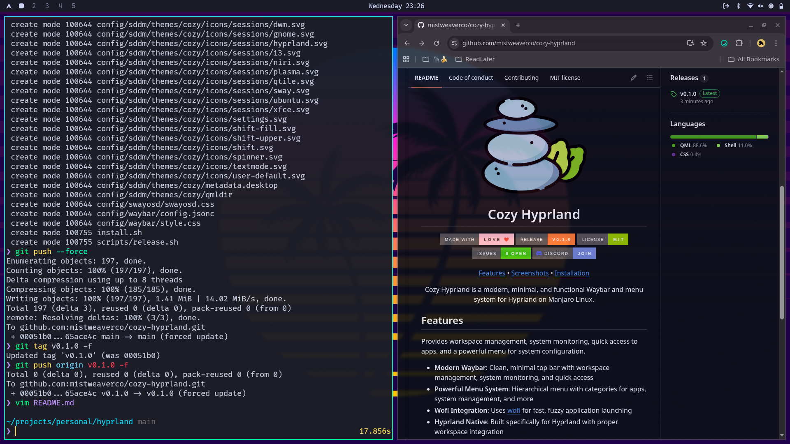

<div align="center">


# Cozy Hyprland

[](https://github.com/mistweaverco/cozy-hyprland/graphs/contributors)
[](https://github.com/mistweaverco/cozy-hyprland/releases/latest)
[](./LICENSE)
[](https://github.com/mistweaverco/cozy-hyprland/issues)
[](https://mistweaverco.com/discord)

[Features](#features) • [Screenshots](#screenshots) • [Installation](#installation)

<p></p>

Cozy Hyprland is a modern, minimal,
and functional Waybar and
menu system for Hyprland on Manjaro Linux.

<p></p>

</div>

## Features

Provides workspace management,
system monitoring,
quick access to apps, and
a powerful menu for system configuration.

- **Modern Waybar**: Clean, minimal top bar with workspace management, system monitoring, and quick access
- **Powerful Menu System**: Hierarchical menu with categories for apps, system management, and more
- **Wofi Integration**: Uses [wofi](https://hg.sr.ht/~scoopta/wofi) for fast, fuzzy application launching
- **Hyprland Native**: Built specifically for Hyprland with proper workspace integration

## Screenshots



The waybar provides:

- Workspace management with click-to-switch
- System monitoring (CPU, memory, battery, network)
- Audio controls with click-to-open pavucontrol
- Bluetooth and network status
- Update notifications
- Clean, modern styling with full Nerd Font icons

The menu system includes:

- Application launcher
- System management (lock, suspend, restart, shutdown)

## Installation

Install the required packages:

```bash
./install.sh
```

